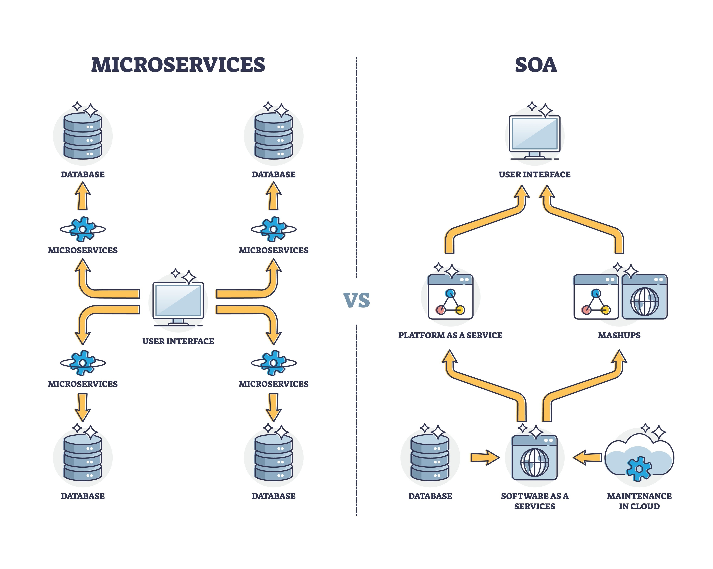

## System Architecture

### High-Level Overview
Chronos utilizes a Microservices Architecture optimized for low-latency financial transactions. Unlike tradition REST-based microservices, Chronos services communicate via ZeroMQ (ZMQ) over TCP/IPC to minimize serialization overhead and network jitter.

The system is containerized using Docker, allowing for horizontal scalability via Symbol Sharding (dedicating distinct execution engines to specific asset classes or ticker symbols).

## Component Diagram

## Component Details

### A. Gateway Service ( The Ingress )
* **Role** : The single entry point for all external clients.

* **Responsibility:**
  * Accepts TCP/UDP connections.
  * Parses incoming raw bytes into Order structs.

* **Routing:** Directs orders to the correct Matching Engine based on Symbol (e.g., AAPL -> Engine 1).

* **Scalability:** Can be replicated behind a Layer 4 Load Balancer if connection volume exceeds single-node capacity.

### B. Risk Engine ( The AI Guard )**

* **Role:** Pre-trade validation using Artificial Intelligence.

* **Tech Stack:** C++ wrapper around ONNX Runtime.

* **Logic:**

  * **Static Checks:** "`Is order value > $1M?`" (Hard limits).

  * **Dynamic Checks:** "`Does this order look like a 'spoofing' attack?`" (AI Model).

* **Performance:** Positioned as a Sidecar or inline filter. Must reply in <50µs.

### C. Matching Engine ( The Core )**
* **Role:** The Limit Order Book (LOB).
* **Tech Stack:** Pure C++20, Lock-Free Data Structures.

**Concurrency Model:**
  * **Single-Threaded Event Loop:** To eliminate context-switching costs.

  * **CPU Pinning:** Docker containers are pinned to isolated CPU cores (--cpuset-cpus) to prevent OS scheduler interference.

* **Memory Management:** Uses custom std::pmr memory pools to ensure **Zero Allocations** on the hot path.

### D. Persistence Service ( The Ostrich )
* **Role:** Logging and Audit.
* **Strategy:** Asynchronous decoupling. The Matching Engine "fires and forgets" trade data via a ZeroMQ PUB socket. This service listens and writes to disk/database off the critical path, ensuring that slow disk I/O never slows down trading.

### 4. Scalability Strategy
   Chronos does not use generic Round-Robin load balancing. Instead, it uses **Functional Partitioning (Sharding):**

   | Scaling Scenario |Strategy |Docker Implementation |
   |------------------| ------- |--------------------- |
   |Increase in Trading Volume (More Ticks)	|Vertical Scaling	|Allocate more CPU/RAM to the container. Pin to faster cores.|
   |Increase in Asset Count (More Symbols)	|Horizontal Sharding	|Spin up new Matching Engine containers. Config Gateway to route Symbol X to Container X.|
   |Increase in Client Connections	|Gateway Replication	|Spin up multiple Gateway containers behind a VIP (Virtual IP).|

### 5. Deployment (CI/CD)
* **Build:** Multi-stage Docker builds ensure compilation tools (GCC 13) are not present in production images.=
* **Orchestration:** Capable of deployment on Kubernetes with hostNetwork: true to bypass virtual network bridges for maximum performance.
* **Security:** Containers are scanned for vulnerabilities (Trivy) and logic flaws (CodeQL) before deployment.